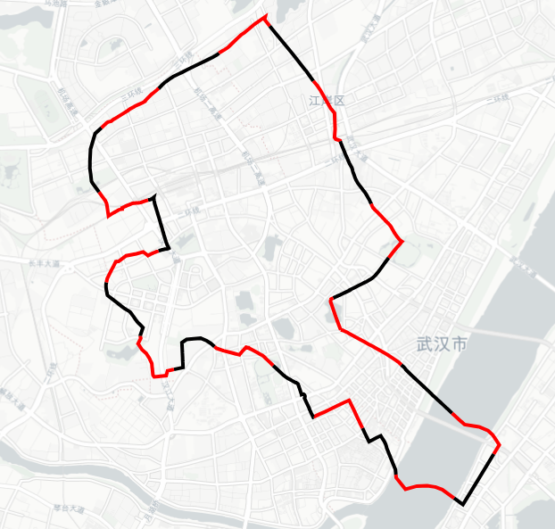

# lineseg

Cut the line into equal length segments. Born in [maptalks.three](https://github.com/maptalks/maptalks.three)



## DEMO 
[geo line](https://deyihu.github.io/lineseg/test/index.html)  
[simple line](https://deyihu.github.io/lineseg/test/pixel.html)

## Install

### NPM

```sh
npm i lineseg

```

### CDN

```html
<script
  type="text/javascript"
  src="https://unpkg.com/lineseg/dist/lineseg.js"
></script>
```

## API

- lineSeg(line,options)
  - `line` , Collection of points,such as [[x,y],[x,y],[xy],.......];
  - `options.segDistance` , per seg length
  - `options.isGeo` ,Is it geographical coordinates


### ESM

```js
//ESM
import {
    lineSeg
} from "lineseg";
const line = [
    [x, y],
    [x, y],
    [x, y],
    [x, y],
    [x, y], ..........
];
const seg = lineSeg(line, {
    segDistance: 100,// per seg length
    isGeo: true //Is it geographical coordinates
})
```

### nodejs

```js
//nodejs
const {lineSeg} = require("lineseg");
const line = [
    [x, y],
    [x, y],
    [x, y],
    [x, y],
    [x, y], ..........
];
const seg = lineSeg(line, {
    segDistance: 100,// per seg length
    isGeo: true //Is it geographical coordinates
})
```

### CDN

```html
<script
  type="text/javascript"
  src="https://unpkg.com/lineseg/dist/lineseg.js"
></script>
<script>
      const line = [
      [x, y],
      [x, y],
      [x, y],
      [x, y],
      [x, y], ..........
  ];
    const segs = lineseg.lineSeg(line, { segDistance: 100 });
</script>
```
